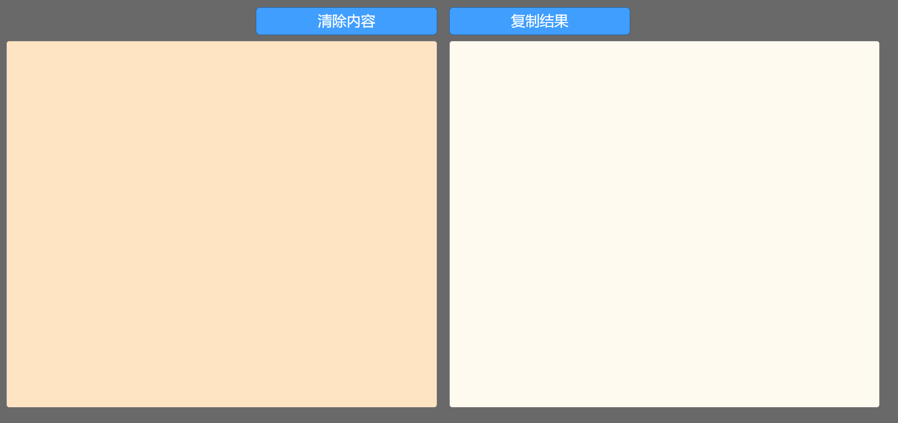
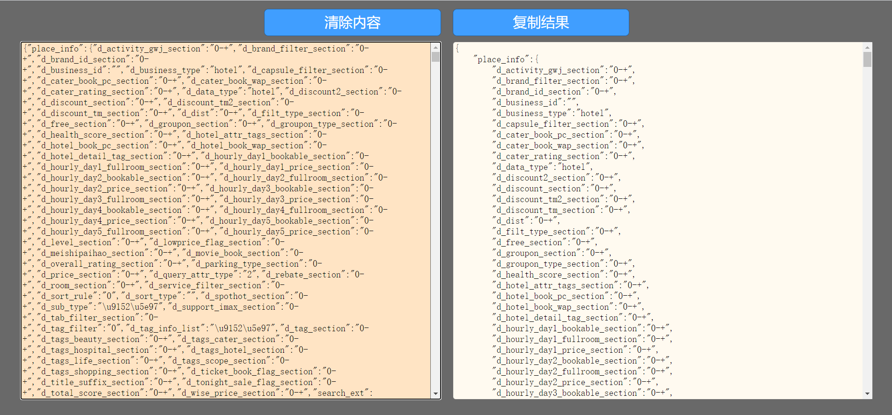
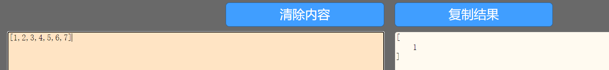
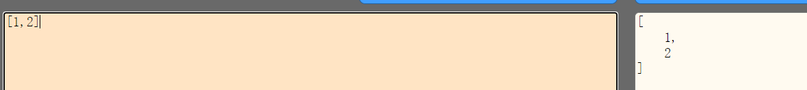

# 使用指南

**改项目研发的初衷是为了更加清晰地看出请求返回的数据的结构，为此对返回数据进行了`简化`和`结构化`的操作**

如下图左边输入框输入文本内容，在右侧获得结果

左边框中输入的必须是可以转化为**JSON对象**的字符串，即可以用**JSON.stringfy()**函数处理，则会在右侧框中获得**简化**并**结构化**的数据

简化：即会对数组进行简化，如下图，多项变为一项

但对于长度为2的数组，数组内容不为对象或数组，则会保留着两项

